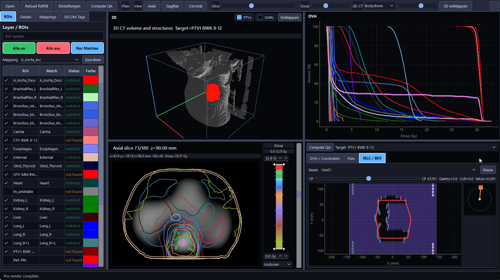

# PlanEval RT Viewer

Fast desktop viewer and research QA workbench for radiotherapy DICOM plans.



PlanEval RT Viewer loads local RT DICOM folders and combines plan inspection,
DVH review, constraint checking, target metrics and MLC/BEV inspection in one
PySide6 application. The current code is research software and is not clinically
validated for direct treatment decisions.

## Features

- Load DICOM folders with CT, RTSTRUCT, RTDOSE and optional RTPLAN.
- Handle CT/RTSTRUCT/RTDOSE cases even when no RTPLAN is available.
- Switch between axial, sagittal, coronal and embedded 3D views.
- Inspect 3D CT body/bone surfaces or volume rendering with dose overlay.
- Toggle 3D PTV/target and OAR structure groups independently.
- Navigate slices with scroll bar, mouse wheel and `Ctrl` + mouse wheel zoom.
- Show dose overlays, prescription-relative isodose lines and editable dose
  display ranges.
- Compute DVHs for visible ROIs and control DVH line visibility from the ROI
  panel.
- Evaluate selectable RefDB/Hub constraint tables against computed DVHs.
- Use manual structure mappings and export the mapping database as JSON.
- Compute target metrics including Paddick-style CI, GI and HI.
- Summarize plan information, monitor units and geometric PAM complexity.
- Inspect RTPLAN MLC apertures by beam/control point with BEV playback.
- Browse DICOM tags with recursive sequence expansion and value search.

## Offline RefDB Fallback

When configured, the app first queries a RefDB/Hub API and stores successful
responses in the local cache:

```text
%LOCALAPPDATA%/PlanEvalViewer/refdb_lookup_cache.json
```

If the Hub is unreachable or returns incomplete constraint table data, the app
falls back to bundled example tables under:

```text
planeval_viewer/refdb/offline_examples/stereotaxie_tables.json
```

The bundled fallback contains synthetic stereotaxy example tables named `STX1`,
`STX3`, `STX5` and `STX8`. These tables are only seed data for demos and tests;
they are not institutional standards and must not be used for clinical review.

## Installation

Use Python 3.13 or a recent Python 3.11+ environment on Windows.

```powershell
python -m pip install -r requirements.txt
python app.py
```

For local development:

```powershell
python -m pytest -q
python -m compileall -q planeval_viewer app.py
```

## DICOM Folder Layout

Select a folder that contains one patient case. Subfolders are allowed.

Recommended contents:

- CT image series from one `SeriesInstanceUID`
- one RTSTRUCT referencing the CT frame of reference
- one RTDOSE aligned to the plan/CT geometry
- optional one or more RTPLAN files

When multiple RTPLAN files are found, the app loads the case once and exposes a
plan switcher in the toolbar.

## RefDB / Hub Configuration

Set one or more Hub endpoints with `PLANEVAL_REFDB_URLS`:

```powershell
$env:PLANEVAL_REFDB_URLS = "http://hub-host:5001;http://fallback-host:5001"
python app.py
```

The app uses `POST /api/refdb/lookup/batch` and client-side fraction filtering
by default. Matching is combined from live Hub data, the local cache and bundled
offline examples.

## Data Protection

Do not commit patient data, DICOM files, screenshots with identifiable anatomy,
DICOM UIDs, names, MRNs, accession numbers or free-text clinical notes. The
repository should only contain source code, synthetic tests, documentation and
non-patient example metadata.

## Status

This project is under active development. It is designed for local research,
medical physics review and software prototyping, not as a validated clinical
decision support system.
